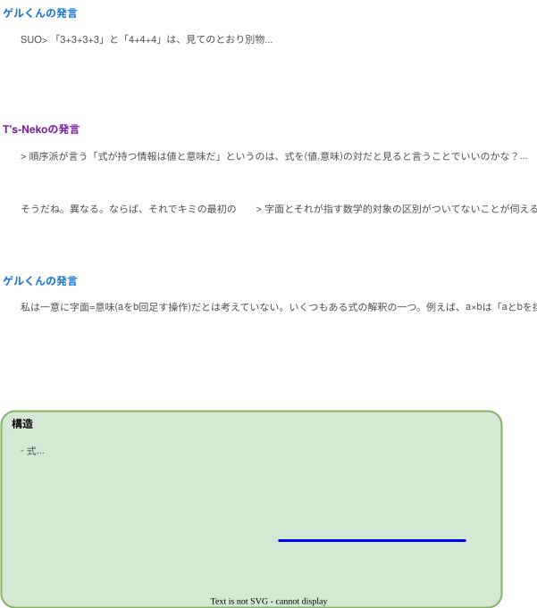
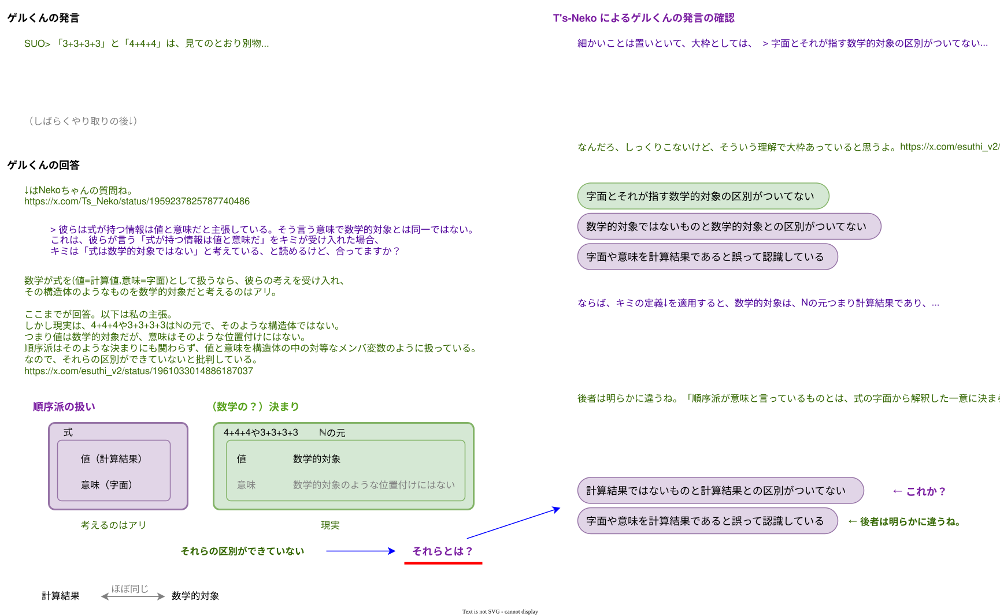

# 副司令官ゲル（旧shigeru）さんとの会話

* TOC
{:toc}


<!--========-->
```
SUO> 「3+3+3+3」と「4+4+4」は、見てのとおり別物

「見てのとおり」と言っているから、字面とそれが指す数学的対象の区別がついてないことが伺える。
3+3+3+3も4+4+4も、12が指す数学的対象と同一のものを指す。別物ではない。

（引用）
    「3+3+3+3」と「4+4+4」は、見てのとおり別物だ。
    両者の値（大きさ）は同じだ。

    たったこれだけの話。

    反順序（笑）もそれが分かっているからこそ、「教科書の定義は認めぬ、媚びぬ、省みぬ」でゴリ押しするしかない。
    認めたら順序の区別がついてしまって死にますから（笑）
    https://x.com/Ruins_Walkers/status/1958772421433204962
```
[Post]<https://x.com/esuthi_v2/status/1958826105713938484>

<!--========-->
```
「3+3+3+3」と「4+4+4」を字面と言ってるのかな？
```
[Post]<https://x.com/Ts_Neko/status/1959188392874586616>

<!--========-->
```
数式の見た目のことですね。
```
[Post]<https://x.com/esuthi_v2/status/1959202072869618151>

<!--========-->
```
見ての通りは見た目についてとは限らないよ。

ところで、

・3+3+3+3
・4+4+4
・12が指す数学的対象

これらが同一のものを「指す」とキミは言っているけど、「指すもの」は、SUOさんが言った「値（大きさ）」のことかな？
```
[Post]<https://x.com/Ts_Neko/status/1959223033689780254>

<!--========-->
```
彼らが意味と呼ぶものは、式が指す数学的対象からは読み取れない。式の字面から類推できるもの。だから見ての通りを見た目と解釈している。

彼らは式が持つ情報は値と意味だと主張している。そう言う意味で数学的対象とは同一ではない。
```
[Post]<https://x.com/esuthi_v2/status/1959229202307408287>

<!--========-->
```
> 彼らは式が持つ情報は値と意味だと主張している。そう言う意味で数学的対象とは同一ではない。

これは、彼らが言う「式が持つ情報は値と意味だ」をキミが受け入れた場合、キミは「式は数学的対象ではない」と考えている、と読めるけど、合ってますか？
```
[Post]<https://x.com/Ts_Neko/status/1959237825787740486>

<!--========-->
```
数学的対象について共通認識を持ちたいので、数学的対象という言葉に関してNekoちゃんの定義を聞かせてくれますか？
```
[Post]<https://x.com/esuthi_v2/status/1959241460563468455>

<!--========-->
```
キミが言った言葉だからキミの定義に合わせるよ。いろいろあるからね。キミの定義は、何だい？
```
[Post]<https://x.com/Ts_Neko/status/1959243223093678417>

<!--========-->
```
掛け順問題でよく例に挙げられるa×b∈Nの場合、a×bが指す数学的対象はNの元だよ。
```
[Post]<https://x.com/esuthi_v2/status/1959245845330534737>

<!--========-->
```
分かった。

それで以下の質問に対する回答をお願いします。
    https://x.com/Ts_Neko/status/1959237825787740486
```
[Post]<https://x.com/Ts_Neko/status/1959253225204281522>

<!--========-->
```
ごめん、もう一つ共通認識を作っておきたい。順序派が言う「式が持つ情報は値と意味だ」というのは、式を(値,意味)の対だと見ると言うことでいいのかな？
ここで意味というのは、a×bを「aをb回足す操作」と解釈することだと私は認識しているのだが。

手間を取らせちゃってごめんね。
```
[Post]<https://x.com/esuthi_v2/status/1959255161240748347>

<!--========-->
```
「値と意味」は何となく順序派っぽいね。でも、ズバリ「式が持つ情報は値と意味だ」という言葉は検索してもキミのポストしかヒットしない。

キミが望む共通認識の粒度を踏まえると、どこからそう思ったのが踏まえておいたほうがいいと思うんだけど、どこから？
```
[Post]<https://x.com/Ts_Neko/status/1959258378850673075>

<!--========-->
```
kono氏は、値が同じだけど、意味が異なるって言ってるし、NS氏は式には意味があると主張してる。だから、順序派は式は値と意味の二つを持つと考えてると理解してる。
また順序派は、a×bを「aをb回足す操作」、b×aを「bをa回足す操作」だと言い、それが意味の違いだと主張してると認識してる。
```
[Post]<https://x.com/esuthi_v2/status/1959260431253660037>

<!--========-->
```
なるほど。konoさんとNSさんが最近言ってる言葉ね。

> 順序派が言う「式が持つ情報は値と意味だ」というのは、式を(値,意味)の対だと見ると言うことでいいのかな？

式には値（計算結果）と意味（計算する前の式）の両方の側面はあるね。

対とする意図は分からないけど、とりあえず対でヨシとするよ
```
[Post]<https://x.com/Ts_Neko/status/1959269272301027668>

<!--========-->
```
おっけ。
式a×b∈ℕの元では、式が指すものは数学的対象で一つの自然数。順序派の言う、式が指すものは(計算結果,計算前の式)で二つの情報。
これが私の認識でNekoちゃんも理解はできると思う。
結論は、数学的対象≠(計算結果,計算前の式)だね。式から見出す情報の量が異なる。
```
[Post]<https://x.com/esuthi_v2/status/1959272274315591691>

<!--========-->
```
そうだね。異なる。ならば、それでキミの最初の

> 字面とそれが指す数学的対象の区別がついてないことが伺える。

これは矛盾してない？字面=意味だとキミは考えていると思うから、区別がついていると思うけど
```
[Post]<https://x.com/Ts_Neko/status/1959275053188866062>

<!--========-->
```
Nekoちゃんは二つほど勘違いしてると思う。

まず、私は一意に字面=意味(aをb回足す操作)だとは考えていない。いくつもある式の解釈の一つ。例えば、a×bは「aとbを掛ける」とも「aにbを掛ける」とも「bにaを掛ける」とも解釈できる。そう考えている。

二つ目は、数学的対象は順序派の言う値に近い。一方、彼らの言う意味は、字面の解釈のひとつ。前者は数学が等号などで扱う対象。後者はそうではなく、一意にすら定まらないもの。これら二つを式の指すものとして一緒くたにしているので、「区別ができてない」と表現した。

どう？私の意図が理解できた？
```
[Post]<https://x.com/esuthi_v2/status/1959284415814570278>

<!--========-->
```
ちょっと矛盾を感じたから、キミの意見の構造を図示してみたよ。
そうしたら説明が足りないと思われる部分が見つかったので教えてください。

後者は何でしょうか。意味が解釈のどれかであるという意見は分かるけど、それは一緒くたにしている比較対象にはならないと思うのですが。
```
[Post]<https://x.com/Ts_Neko/status/1959426533439029450>

- 

<!--========-->
```
一緒くたが通じないのかな。
順序派の言う意味は、一意に定まらず数学で評価する対象にはならない。にも関わらず、順序派は式の指すもの(値,意味)として、数学的に評価の対象である値と同列に考えている。
こう言い換えると分かるかな？
言語化するって難しいな
```
[Post]<https://x.com/esuthi_v2/status/1959436118392484158>

<!--========-->
```
細かいことは置いといて、大枠としては、
> 字面とそれが指す数学的対象の区別がついてない
ではなく、
数学的対象ではないものと数学的対象との区別がついてない
もしくは、
字面や意味を数学的対象であると誤って認識している
というのがキミの意見ということでよろしいか？
```
[Post]<https://x.com/Ts_Neko/status/1959450209672659167>

<!--========-->
```
なんだろ、しっくりこないけど、そういう理解で大枠あっていると思うよ。
```
[Post]<https://x.com/esuthi_v2/status/1959450907659440385>

<!--========-->
```
ならば、キミの定義↓を適用すると、数学的対象は、Nの元つまり計算結果であり、
計算結果ではないものと計算結果との区別がついてない
もしくは、
字面や意味を計算結果であると誤って認識している
がキミの意見になるけど、それでいいかい？
しっくりこない部分は後で追加説明して構わないよ。
```
[Post]<https://x.com/Ts_Neko/status/1959471873097392216>

<!--========-->
```
後者は明らかに違うね。
「順序派が意味と言っているものとは、式の字面から解釈した一意に決まらないもの」だと、私は認識しているよ。
「Nekoちゃんは計算結果は一意に決まるものだと認識している」と私は思ってたけど、私のその理解が間違ってたかな？
```
[Post]<https://x.com/esuthi_v2/status/1959478669501698061>

<!--========-->
```
キミの認識は確認済みだし、キミの理解も合ってるよ。
私の質問は、最初の↓は正確に言うとどういうことか、です。
```
[Post]<https://x.com/Ts_Neko/status/1959484366423457871>

<!--========-->
```
とすると、Nekoちゃんの
『ゲルは、「順序派が字面や意味を計算結果であると誤って認識している」という意見である』
という認識は誤りだったってことでいい？
Nekoちゃんは、私の発言「字面とそれが指す数学的対象の区別がついてないことが伺える」の真意を改めて尋ねているってことですか？
```
[Post]<https://x.com/esuthi_v2/status/1959541506944995535>

<!--========-->
```
キミの界隈では、確認をする人は誤っている、とするのかい？

https://x.com/esuthi_v2/status/1959478669501698061
が十分な回答になっていないために、話が進んでいないから、回答してほしい。
数学的に言えば、求めるものの陽関数まできちんと書いてということ。
回答は真意かもしれないしそうでないかもしれない。
```
[Post]<https://x.com/Ts_Neko/status/1959771889817309292>

<!--========-->
```
後者の認識は違うといったんだけど、間違いって書いたっけ？
陽関数で何を書くの？
ところで、十分な回答になってないと知りながら、Nekoちゃんは「キミの認識は確認済みだし、キミの理解も合ってるよ」と言ってたの？議論に誠実な態度じゃないよ。
```
[Post]<https://x.com/esuthi_v2/status/1959902911322104256>

<!--========-->
```
間違い？どれ？指示語的な言葉は前に書いた単語を選んでね。

たぶん「確認をする人は誤っている」のことだと思うけど、キミの「という認識は誤りだったってことでいい？」の返事だよ。

「後者の認識は違う」とは関係ないキミの話に合わせた返事だからスルーしていいよ。
https://x.com/esuthi_v2/status/1959541506944995535
```
[Post]<https://x.com/Ts_Neko/status/1960134618491093502>

<!--========-->
```
> 十分な回答になってないと知りながら、Nekoちゃんは「キミの認識は確認済みだし、キミの理解も合ってるよ」と言ってたの？

回答として、
https://x.com/esuthi_v2/status/1959478669501698061
の質問が来たのでそれに答えただけだよ。ただ、その回答だけでは不十分だということ。構造はこう。
（つづく）（つづき）

T)質問A「最初の〜は正確に言うとどういうことか」

└→ G)質問A一部に答えた回答A（質問Bを含む）
.　　└→ T)回答B「キミの認識は確認済みだし、キミの理解も合ってるよ」

└→ 足りなかった部分の回答（これを待っています）
```
[Post]<https://x.com/Ts_Neko/status/1960135303328563200>

<!--========-->
```
AもしくはB。後者はB。リンク参照してね❤️
陽関数の説明は？
もう時間空いちゃったから、足りなかった部分がよく分からんわ。足りない部分がどこか具体的に書いてくれる？
よろしく〜
https://x.com/Ts_Neko/status/1959471873097392216
```
[Post]<https://x.com/esuthi_v2/status/1960267837643071621>

<!--========-->
```
>> 数学的に言えば、求めるものの陽関数まできちんと書いてということ。

> 陽関数の説明は？

理由だけでなく最後の答えまできちんと示してということのたとえなのが読めないのかい？
```
[Post]<https://x.com/Ts_Neko/status/1960505556713791602>

```
> もう時間空いちゃったから、足りなかった部分がよく分からんわ。

記憶じゃなくて過去のポストを読めばわかることなんだけど。
https://x.com/Ts_Neko/status/1959471873097392216
（つづく）（つづき）
私が「それでいいかい？」と質問したら
キミは、「後者は明らかに違うね。」
残るは前者。
「～だと、私は認識しているよ。」
は前者が合っているかどうかの理由だから、結論ではない（足りない）。
```
[Post]<https://x.com/Ts_Neko/status/1960505952425435630>

<!--========-->
```
長いよ。簡潔にまとめて。
Neko> 理由だけでなく最後の答えまできちんと示してということのたとえなのが読めないのかい？
読めないよ。
Neko> 残るは前者。
前者？指示語的な言葉は前に書いた単語を選んでね。
```
[Post]<https://x.com/esuthi_v2/status/1960687453905543242>

<!--========-->
```
「結論（回答）は？」が長いのか？
「前者」は「後者」の他方だから分かるだろ。
```
[Post]<https://x.com/Ts_Neko/status/1960705817352810599>

<!--========-->
```
3リプもだらだら書かなくていいよ。
陽関数って何さ？
それが分からなかったのがNekoちゃんでしょ。そんなダブスタなことしないで、前者を具体的に教えてよ。
```
[Post]<https://x.com/esuthi_v2/status/1960707577131753540>

<!--========-->
```
なんで分からないフリするんだよ。
陽関数に関しては、理由だけでなく最後の答えまできちんと示してということのたとえだと言ってるだろ。
前者は「計算結果ではないものと計算結果との区別がついてない」だろ。
マジで読解力ないのか。
```
[Post]<https://x.com/Ts_Neko/status/1960717094007320723>

<!--========-->
```
ふりなんてしてないよ。陽関数とその例えの繋がりがしっくり来なかったから、真面目に尋ねてたんだよ。
イラつかせたのは謝るよ。ごめんね。
計算結果は、式の指す数学的対象とほぼ同じだって言ったよね。計算結果でないものとして私が念頭に置いているのは、順序派がいう式の意味だというのはOk？
```
[Post]<https://x.com/esuthi_v2/status/1960724982906151297>

<!--========-->
```
OK。
計算結果は、数学的対象と、ほぼ同じ。
意味は、計算結果、ではない。
```
[Post]<https://x.com/Ts_Neko/status/1960854236008472738>

<!--========-->
```
↓はNekoちゃんの質問ね。
https://x.com/Ts_Neko/status/1959237825787740486
数学が式を(値=計算値,意味=字面)として扱うなら、彼らの考えを受け入れ、その構造体のようなものを数学的対象だと考えるのはアリ。

ここまでが回答。以下は私の主張。
しかし現実は、4+4+4や3+3+3+3はℕの元で、そのような構造体ではない。
つまり値は数学的対象だが、意味はそのような位置付けにはない。
順序派はそのような決まりにも関わらず、値と意味を構造体の中の対等なメンバ変数のように扱っている。
なので、それらの区別ができていないと批判している。
```
[Post]<https://x.com/esuthi_v2/status/1961033014886187037>

<!--========-->
```
会話として違うんだよなぁ。
まだ十分に答えて貰ってない質問は、これ↓（前者）
https://x.com/Ts_Neko/status/1959450209672659167
小学生が文章問題の「こたえ」の部分に書く内容は、理由（キミの考え）ではなく、質問が要求していることです。
私が聞きたいのは、私が求めている観点でのキミの意見だから、そこに合わせて推論してほしいのです。
乱暴な言い方をすれば、
『「数学的対象ではないものと数学的対象との区別がついてない」というのがキミの意見なのか』について、とりあえず「はい」か「いいえ」で答えてください。
とも言える
```
[Post]<https://x.com/Ts_Neko/status/1961212794906579307>

<!--========-->
```
わがままNekoちゃんで草🌱
人に推論を求める前に、相手の発言からその意図を推論したらいいと思うよ。その上で、こういう意図ですか？って尋ねた方が建設的だと思うけどね。分からないなら、分からないって言ってもらってもいいけど。
ここで自分の考えるYes/Noの型にはめるのは何だか美しくないよ。
```
[Post]<https://x.com/esuthi_v2/status/1961440898052755624>

<!--========-->
```
相手の意図を推論しましたとは明示しないけど、返答を読むときは普通に双方の思考のモデルを想像しています。話を聞かない人たちと違ってね。

ただ、その思考のモデルを俯瞰的に相手に明示することは少ないでしょう。コストがかかるからね。でも疑っているようなので明示します（添付）。
（つづく）（つづき）
私が聞きたいのは、私が求めている観点でのキミの意見だから、そこに合わせて推論してほしいのです。

> ここで自分の考えるYes/Noの型にはめるのは何だか美しくないよ。

Yes/Noは乱暴な言い方だと私は言いましたよ。
```
[Post]<https://x.com/Ts_Neko/status/1962308228664140061>

- 


<!--========-->
<!--
>```
> もう時間空いちゃったから

過去のポストぐらい見なよ。
私はポストのまとめを作っているから、良かったら参照して。
https://takakiriy.github.io/documents/X-conversation/geru/2025-08-23.html
```
-->