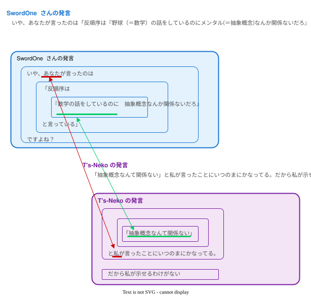
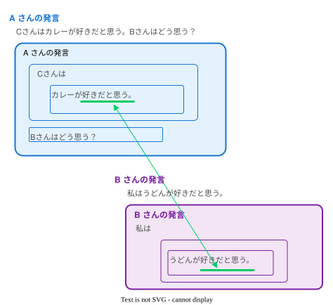
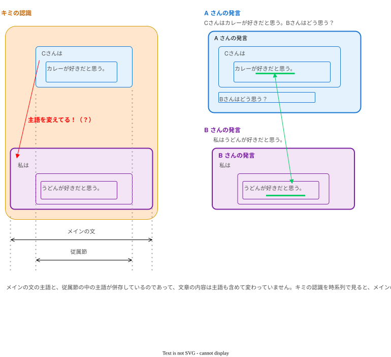
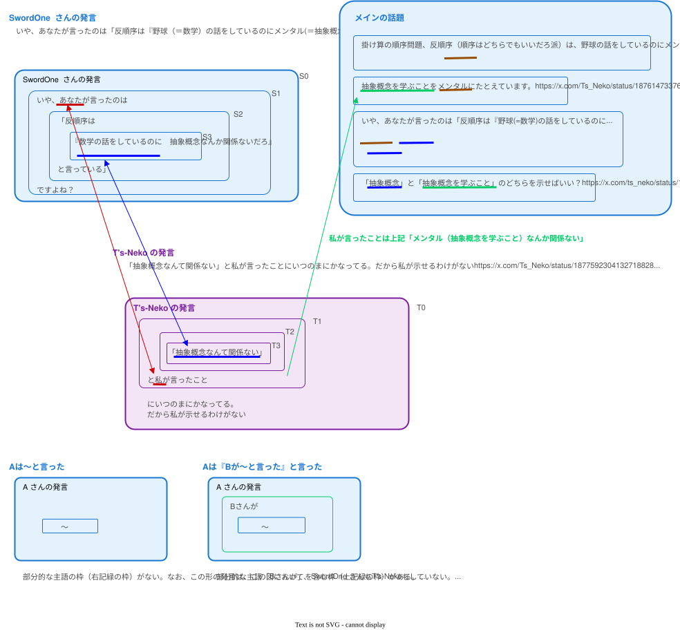
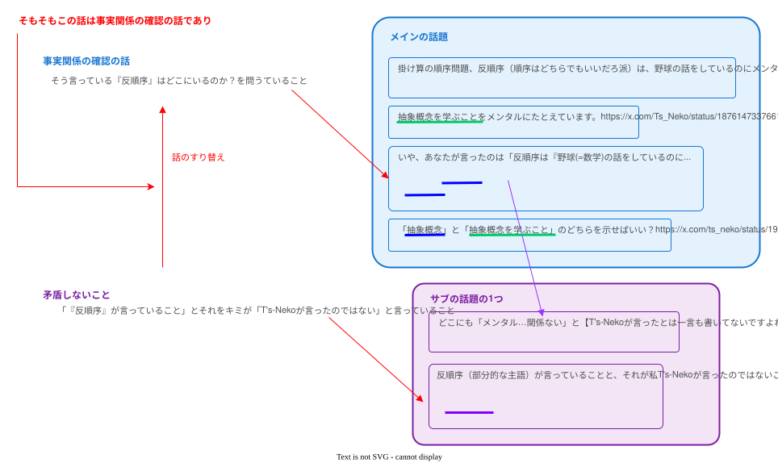
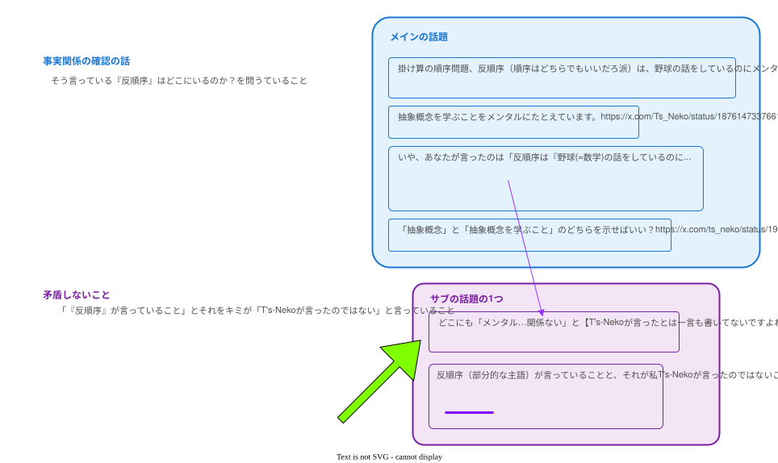

# SwordOne さんとの会話

* TOC
{:toc}


## （スタック）

- 1.b 「主張している」ところを読めよ
- 主張の話 https://x.com/twinklepoker/status/1952577134800859425
- 1.c 抽象概念と抽象概念を学ぶこと
- 1.d 『メンタル(抽象概念)なんか関係ないだろ』と言っている」の主語は何？
- 1.d.a 図が作られるまで待つことはしない
- 1.d.b そんな人は存在しない。反順序が言っていることを示して
  - 「抽象概念」と「抽象概念を学ぶこと」のどちらを示せばいい？   （質問）
- 1.d.c T's-Neko氏が言ったと言ったように決めつけられている、主語が変わっている
- 1.e 矛盾しないこと。サブの話題
- 1.g わざわざ手間をかけて図まで描いてるのに
- 1.g.c 🔔主語が変わっている(2)


## 1 ストローマン論法してるのはそっちなのよ

<!--========-->
```
ストローマン論法してるのはそっちなのよ。
（添付画像）
    SwordOne @twinklepoker · 1月8日
    「抽象概念なんて関係ない」なんて誰が言ってるんですか？
    https://x.com/twinklepoker/status/1876838165157122306

    エイリュウ @Eiryu0924 · 1月10日
    T's-Nekoさんは
        「数学」と言っているのに示したのに、
        「抽象概念なんて関係ない」と言っている人
    は示せないんですね。
    一字一句同じでなくてもいいのに示せないのは、T's-Nekoさんの妄想だったからでしょう。
    https://x.com/Eiryu0924/status/1877590993345851677

    T's-Neko（プログラマー）... · 1月10日
    「抽象概念なんて関係ない」と私が言ったことについのまにかなってる。だから私が示せるわけがない
    [引用ツイート]
        SwordOne @twinklepoker · 1月7日
        いや、あなたが言ったのは
        「反順序は『野球(=数学)の話をしているのにメンタル(=抽象概念)なんか関係ないだろ』と言っている」ですよね？
        「抽象概念が関係ない」なんて誰が言っ
    https://x.com/Ts_Neko/status/1877592304132718828
```
[Post]<https://x.com/twinklepoker/status/1952010615473774856>

- #search: 過去のスレッド、野球の例え話

- 続き #search: ストローマン論法してるのはそっちなのよ(2)


## 1.a 過去のスレッド、野球の例え話

#keyword: 野球の例え話

<!--========-->
```
掛け算の順序問題、反順序（順序はどちらでもいいだろ派）は、
野球の話をしているのにメンタルなんか関係ないだろ！と言ってるようなものだな
```
[Post]<https://x.com/Ts_Neko/status/1875799718850371950>

- #keyword: 抽象概念を学ぶこと

- T's-Neko のポスト
  - 反順序は（以下）と言ってるようなもの
    - 野球の話をしているのにメンタルなんか関係ないだろ！
    - 数学の話をしているのに抽象概念を学ぶことなんか関係ないだろ！（「抽象概念なんて関係ない」ではない）

<!--========-->
```
野球が算数にたとえられているとして、
メンタルは何に相当するんですか？
```
[Post]<https://x.com/pop43265684/status/1876123419798044866>

<!--========-->
```
算数ではなく、数学を野球にたとえています。
抽象概念を学ぶことをメンタルにたとえています。
```
[Post]<https://x.com/Ts_Neko/status/1876147337661407295>

<!--========-->
```
小学二年生で学ぶのは算数ですよね。
で、算数を学ぶ際に、数学の抽象概念が関係するというのは何に基づいているのですか？
```
[Post]<https://x.com/pop43265684/status/1876319330423668910>

<!--========-->
```
みんな数学って言ってますよ。私はそれを踏まえただけです。
```
[Post]<https://x.com/Ts_Neko/status/1876319527241441602>

<!--========-->
```
算数は数学ですが、
あなたの認識ではそれは「皆が言っているから」という認識だということですか？
まあそれはその程度の認識ということで別に構いませんが。
それで、何に基づいての話なんですか？
肝心の部分に回答がないですが。
```
[Post]<https://x.com/pop43265684/status/1876330598199087463>

<!--========-->
```
？？？
何の話をしてるんですか？
反順序の人の話をしているので↓、反順序のみんなが言っているから、で十分ですよ？
（引用）https://x.com/Ts_Neko/status/1875799718850371950
```
[Post]<https://x.com/Ts_Neko/status/1876335903272313319>

<!--========-->
```
あなたの発言についての話ですが、それも分からない感じですか？
その反順序の皆が言っているのってたとえばどれですか？
どれか一つ貼ってもらえますか？
```
[Post]<https://x.com/pop43265684/status/1876363153279442949>

<!--========-->
```
私「みんな数学って言ってますよ」
これが何に対する回答なのか分からない感じですか？↓
そして、反順序のみなさんは数学と言ってますよ↓
（引用画像）
```
[Post]<https://x.com/Ts_Neko/status/1876395136126722169>

<!--========-->
```
いや、あなたが言ったのは
「反順序は『野球(=数学)の話をしているのにメンタル(=抽象概念)なんか関係ないだろ』と言っている」ですよね？
「抽象概念が関係ない」なんて誰が言ってるんですか？
https://x.com/Ts_Neko/status/1875799718850371950
```
[Post]<https://x.com/twinklepoker/status/1876475973887254597>

- #keyword: 抽象概念なんて関係ない

- SwordOne さんの意見は（以下）  #keyword: SwordOne さんによるストローマン論法
  - T's-Neko が（以下）を言ってますね
    - 反順序は（以下）と言っている
      - 野球(=数学)の話をしているのにメンタル(=抽象概念)なんか関係ないだろ（抽象概念なんて関係ない）

<!--========-->
```
「抽象概念なんて関係ない」なんて誰が言ってるんですか？
```
[Post]<https://x.com/twinklepoker/status/1876838165157122306>

- T's-Neko が言っていること  #search: 抽象概念を学ぶこと

<!--========-->
```
T's-Nekoさんは「数学」と言っているのは示したのに、「抽象概念なんて関係ない」と言っている人は示せないんですね。
一字一句同じでなくてもいいのに示せないのは、T's-Nekoさんの妄想だったからでしょう。
```
[Post]<https://x.com/Eiryu0924/status/1877590993345851677>

- #keyword: エイリュウさんのポスト

<!--========-->
```
「抽象概念なんて関係ない」と私が言ったことにいつのまにかなってる。だから私が示せるわけがない
（引用）https://x.com/twinklepoker/status/1876475973887254597
```
[Post]<https://x.com/Ts_Neko/status/1877592304132718828>

- T's-Neko が言っていること  #search: 抽象概念を学ぶこと

- #search: 抽象概念なんて関係ない


## 1(2) ストローマン論法してるのはそっちなのよ(2)

<!--========-->
```
エイリュウさんがストローマン論法しているのを私が指摘しているのが読めないのかな。
```
[Post]<https://x.com/Ts_Neko/status/1952159908033626229>

- #search: https://x.com/Eiryu0924/status/1877590993345851677

<!--========-->
```
エイリュウ氏は
「T's-Neko氏が『抽象概念なんて関係ない』と言った」
という主張は【していない】ので、
T's-Neko氏の
「〜と私が言ったことになっている」
というのは何の指摘にもなっていない。
したがって「エイリュウ氏かストローマン論法しているのを指摘している」とは絶対に読めない。

むしろ、エイリュウ氏がしていない主張を、あたかもエイリュウ氏が主張したかのように話しているあなたの論法こそかストローマン論法。

件の発見の直後にそれ指摘してるんだけど、読めない？
（引用）
    え？誰も「あなたが言った」なんて一言も言ってませんけど？
    https://x.com/twinklepoker/status/1877595765712867552
発見→発言
```
[Post]<https://x.com/twinklepoker/status/1952279698517725523>

<!--========-->
```
過去を辿ったら、エイリュウさんは、キミのポストに乗ってしまい、結果的にストローマン論法になってしまったんだね。
つまり、キミがストローマン論法を始めたんだよ。もしくは、読めてない。
https://x.com/twinklepoker/status/1876475973887254597

過去の現在のスレッドをまとめておきました。
https://takakiriy.github.io/documents/X-conversation/swordone/2025-08-04.html
```
[Post]<https://x.com/Ts_Neko/status/1952492337046921344>

- #search: エイリュウさんのポスト
- #search: SwordOne さんによるストローマン論法
- #search: 抽象概念なんて関係ない
- #search: 抽象概念を学ぶこと

<!--========-->
```
どこがストローマン論法だって言ってんの？
```
[Post]<https://x.com/twinklepoker/status/1952492588562628937>

<!--========-->
```
2つ目のリンク先を見てね
```
[Post]<https://x.com/Ts_Neko/status/1952492999763722624>

<!--========-->
```
貴方が日本語読めない人間だってことを大々的に言ってるようにしか見えない。
（煽り画像）
あとついでにこれも返しておこうかな。
（引用）
    「読まなくても小学生でもできる回答をしたら、その程度のクズ人間」でしたっけ？
    （T's-Nekoの引用）
    https://x.com/twinklepoker/status/1881976324404961677
```
[Post]<https://x.com/twinklepoker/status/1952494274916040769>

<!--========-->
```
誰も主張してない論をもってして「ストローマン論法」だと言い張る自分自身がストローマン論法をしていることを全く理解していない図。
```
[Post]<https://x.com/twinklepoker/status/1952495204709388753>

<!--========-->
```
相変わらず具体性が無いね
```
[Post]<https://x.com/Ts_Neko/status/1952496061425266831>

<!--========-->
```
既に言ったことだからね。
やっぱり読んでないでしょ。
（引用）
https://x.com/twinklepoker/status/1952279698517725523
本来なら言うまでもないことだが、当然私自身も同様の主張は【していない】。
```
[Post]<https://x.com/twinklepoker/status/1952496583268094014>

- 以下、話題が分岐

### 1.b 「主張している」ところを読めよ

<!--========-->
```
いや、私が「主張している」ところを読めよ。
引用先にある「主張はしていない」の前のポストまでは、「主張をしている」ことを踏まえた発言だろ？
引用先にある「主張はしていない」もまたズレ始めてるんだよ。
```
[Post]<https://x.com/Ts_Neko/status/1952498991662510351>

<!--========-->
```
>引用先にある「主張はしていない」の前のポストまでは、「主張をしている」ことを踏まえた発言だろ？
その前提が成立してないんだから、貴方のその主張自体がデタラメでしかないって話なんだよ。
こちらが主張していないことを「主張している」と「踏まえて」発言してるんだから、それこそが「ストローマン論法」だって言ってるんだけど？
結局この時と何も変わっていない。
「お前は俺の話を聞け。しかし俺はお前の話は聞かない」と言っているようなもの。
（引用）
    は？
    対応の正当性を検証してないのに、なんで「例え話の構造と一致する」なんて言える？
    あと「聞くまでもない」って、「俺の意見は絶対だ」って言ってんのと変わらんよ？
    https://x.com/twinklepoker/status/1881681125820834020
```
[Post]<https://x.com/twinklepoker/status/1952577134800859425>

<!--========-->
```
私は「文章そのもの」について言っているのに、キミの返事は「その前提」について。うーん、キミもよわむしさんと同じく返事にコストをかけないね。

前提が異なったとしても私の文章の意味は変わらない。それでも、前提の話に変えるかい？（主張の話はその後で）
```
[Post]<https://x.com/ts_neko/status/1952888446835401038>


### 1.c 抽象概念と抽象概念を学ぶこと

<!--========-->
```
ちなみに「抽象概念」と「抽象概念を学ぶこと」の違いは大して影響はない。
「誰がそんなことを言ったのか？」という問いそのものには何ら影響がないからだ。
（引用）
    ３枚目。メンタルの例えを「抽象概念」にしたのは少々雑だったが、
    主題である「反順序の誰がそのようなことを言ったのか？」という質問にはほとんど影響がない。
    そして繰り返しになるが、今の時点で【T's-Nekoが掛け算の順序に関してどのような主張をしているかは全く関係ない】。
    https://x.com/twinklepoker/status/1879824265815712000
```
[Post]<https://x.com/twinklepoker/status/1952498871101460820>

<!--========-->
```
ついに出たね。
独自理論の後付け。
そこがストローマン論法なのに、話を逸らしたね。
影響がない？なんで？訂正したら？
```
[Post]<https://x.com/Ts_Neko/status/1952499976522924464>

<!--========-->
```
逆。そういう主張をしたところを貴方が持ってくれば済む話。
それをせずに貴方はウダウダ言い訳ばかりしている。
そもそも「抽象概念を学ぶこと」どうこうってこと自体が後付けだろうが。
（引用）
    その意見が間違ってるって指摘だよ。
    いい加減日本語を呼んでくれ。
    あとそもそも、「3×4と4×3は違う」って話自体、具体的事象とセットになって説明されてるから、「抽象概念」とは真逆の話になってる。
    だからこの話を読んで「抽象概念を学ぶこと」の話をしてるとは誰も読み取れない。
    https://x.com/twinklepoker/status/1881486557695410327
```
[Post]<https://x.com/twinklepoker/status/1952502308660765098>

<!--========-->
```
「抽象概念」と「抽象概念を学ぶこと」のどちらを示せばいい？
キミは大して影響はないというけど仮に前者で示したら、「そんなこと言ってない」という話にされてしまうし、前者は示せず後者は示せるという違いがあるから、影響は結構あると思う。
あと私は最初から言ってるから「後付け」ではない。
```
[Post]<https://x.com/ts_neko/status/1952888758388289723>

<!--========-->
```
示すとか示さないとか、何の話をしている？
私は単に「反順序の誰がそんなことを言ったのか」を訊いてるのだが？
```
[Post]<https://x.com/twinklepoker/status/1953700243591377110>

<!--========-->
```
？
だから、「反順序の誰がそんなことを言ったのか」を私が示そうとしているのだけど、そのために「そんなこと」が何かを聞いているんだよ。
話題は重複しているので続きは以下の最新ポストにお願いします。
https://x.com/ts_neko/status/1953612582490931465
```
[Post]<https://x.com/Ts_Neko/status/1954376126983541190>


### 1.d 『メンタル(抽象概念)なんか関係ないだろ』と言っている」の主語は何？

- 前 https://x.com/Ts_Neko/status/1952492337046921344

<!--========-->
```
国語の勉強しようか。
この画像において「『メンタル(抽象概念)なんか関係ないだろ』と言っている」の主語は何？
（画像）
    いや、あなたが言ったのは
    「反順序は『野球（＝数学）の話をしているのに
    メンタル(＝抽象概念)なんか関係ないだろ』と言っている」ですよね？
他人を(ありもしない)ストローマン論法だとなじる前に、まずは自分の読解を省みようね。
```
[Post]<https://x.com/twinklepoker/status/1952689771337146583>

<!--========-->
```
> まずは自分の読解を省みようね。
また、いつもの相手への決めつけかい。
「2つ目のリンク先を見てね」とガイドしたのをもう忘れたの？
そこにちゃんとネストした構造を解析しているよ。
https://x.com/Ts_Neko/status/1952492999763722624
（つづく）（つづき）
回答:
「メンタル…言っている」の主語は反順序。
ちなみに『「反順序は…言っている」』の主語は私。

自分が答を知っている問題を出すことは、人を試すようなことになり、失礼だよ。数学◯◯はそれが分からない。
```
[Post]<https://x.com/ts_neko/status/1952889461655912680>

<!--========-->
```
であれば、「メンタル…言っている」反順序が存在しないのだから、「『反順序は…言っている』」あなたがストローマン論法をしているという結論以外になりようがありません。
こんな単純なことがわからないのだから、主語述語がわからないと疑うのは当然でしょう？
一番重要なこと書くの忘れた。
どこにも「メンタル…関係ない」と【T's-Nekoが言ったとは一言も書いてないですよね？】
わざわざ主語確認したんですから、いい加減これ理解してもらわないと困る。
```
[Post]<https://x.com/twinklepoker/status/1953012994138632582>

<!--========-->
```
> あなたがストローマン論法をしているという結論以外になりようがありません。
> どこにも「メンタル…関係ない」と【T's-Nekoが言ったとは一言も書いてないですよね？】
なんで、反順序（部分的な主語）が言っていることと、それが私T's-Nekoが言ったのではないこと（比較する2つを
（つづく）（つづき）
きちんと書けよ）が矛盾しないこと、そして、「メンタル…言っている」反順序が存在しないというキミの決めつけで、ストローマン論法になるんですか。
むちゃくちゃです

ということで、対象の文章の全体の構造と、関連する返事との関係を解説する図を作っているのだけど、
（つづく）（つづき）
思ったより時間がかかっているので、ちょっと待ってもらえますか？
```
[Post]<https://x.com/Ts_Neko/status/1953265363820671184>
[Post]<https://x.com/Ts_Neko/status/1953266718241140761>

<!--========-->
```
>「メンタル…言っている」反順序が存在しないというキミの決めつけで、ストローマン論法になるんですか。
決めつけていない。再三再四「誰がそんなことを言ったのか？」と問うている。一向に出さないから、「そんな人は存在しない」と結論づけるほかない。
それどころか、この1回目の問いの時点で、こちらが「T's-Neko氏が『抽象概念なんて関係ない』と言った」と言ったように決めつけられている。
https://x.com/Ts_Neko/status/1877592304132718828
て、こちらは「T's-Nekoが『抽象概念なんて関係ない』と言った」とは一言も言っていないのだから、
「『抽象概念なんて関係ない』と私が言ったことにいつの間にかなってる。」というのはストローマン論法にほかならない。
```
[Post]<https://x.com/twinklepoker/status/1953337459410124925>


#### 1.d.a 図が作られるまで待つことはしない

<!--========-->
```
https://x.com/Ts_Neko/status/1953266718241140761
待たない。破綻した話をいくら繰り返そうが無駄。
```
[Post]<https://x.com/twinklepoker/status/1953336666401161708>

<!--========-->
```
相手の話を聞かず、早く議論を打ち切りたがってるみたいだね。
私は支離滅裂なことを言う人に対しても真摯に会話をしますよ。
```
[Post]<https://x.com/Ts_Neko/status/1953614412818133365>

<!--========-->
```
最初からこういう支離滅裂な画像しか来ないことが分かりきっていたからだよ。
なんで勝手に主語を変えてんだ。
```
[Post]<https://x.com/twinklepoker/status/1953622689329164347>

<!--========-->
```
主語の話題は重複しているので続きは以下の最新ポストにお願いします。
https://x.com/twinklepoker/status/1953804398125314482
```
[Post]<https://x.com/Ts_Neko/status/1954376276388847855>


#### 1.d.b そんな人は存在しない。反順序が言っていることを示して

<!--========-->
```
（そんな人の存在の話）
> 一向に出さないから、「そんな人は存在しない」と結論づけるほかない。

やっぱり私のポストを読んでないね。おまえらいつもそう。
キミの質問に対する以下の質問に答えてね。
>> 「抽象概念」と「抽象概念を学ぶこと」のどちらを示せばいい？
https://x.com/ts_neko/status/1952888758388289723
```
[Post]<https://x.com/ts_neko/status/1953612582490931465>

- #keyword: 「抽象概念」と「抽象概念を学ぶこと」のどちらを示せばいい

<!--========-->
```
どちらでもない。
問題なのは、「反順序でそういうことを主張した人の発言」。
「私のポストを読んでないね」はこちらのセリフ。
```
[Post]<https://x.com/twinklepoker/status/1953616026811474137>

<!--========-->
```
「反順序でそういうことを主張した人の発言」の「そういうこと」が何かを私はキミの過去の発言から予想して挙げたげて聞いているんだよ？
>> 「抽象概念」と「抽象概念を学ぶこと」のどちらを示せばいい？
本当にこのどちらでもないのかい？（「万が一」そうなら、何だい？）
```
[Post]<https://x.com/Ts_Neko/status/1954374434149761388>


#### 1.d.c T's-Neko氏が言ったと言ったように決めつけられている、主語が変わっている

<!--========-->
```
（T's-Nekoが言ったと言われた話）
> こちらが「T's-Neko氏が『抽象概念なんて関係ない』と言った」と言ったように決めつけられている。

キミが決めつけられたと思っている内容が違うね。

キミの発言の文章の構造と、私の返事の文章の構造と、その対応関係を図示するね。（添付）
（つづく）（つづき）
このように、内容は、単にキミの言ったことをそのままなんですね()。

返された文章だけを読むのではなく、その返信元の文章にある「単語との対応関係」を踏まえることで、読めるようになる。これが「読解力」だよ。

なのにいつもキミたちは人に対して間違いだと言ってるんだよ。
```
[Post]<https://x.com/ts_neko/status/1953613261808840754>

- 

<!--========-->
```
人の発言の主語を勝手に書き換える人間に「読解力」を語る資格はない。
https://x.com/Ts_Neko/status/1953613261808840754
```
[Post]<https://x.com/twinklepoker/status/1953951105345630220>

<!--========-->
```
【私は「抽象概念は関係ない」と言った】と
【私は「反順序が「抽象概念は関係ない」と言った」と言った】
では、意味がまるで違います。
だからわざわざ主語を確認したのに、勝手に主語をすり替えてるのはあなたですよ。
主語を変えているというより、「抽象概念なんて関係ない」の主語を意図的に消してるね。
空のネスト、気にならないの？
いずれにせよ、「そのまま」ではない。
何しろ主語が変わってるんだから、全く別物と言っていい。
```
[Post]<https://x.com/twinklepoker/status/1953804398125314482>

<!--========-->
```
> 主語を変えているというより
> 主語が変わってるんだから
どっちなんだい？
もし、変わっているなら、変わっている前が何で、後が何かを説明してね。
私は主語が変わってないことを図で示したよ。
```
[Post]<https://x.com/Ts_Neko/status/1954374632963977718>

<!--========-->
```
> 空のネスト、気にならないの？

空のネストという図を描くと「図の表現として枠の中が空であること」に気にはなるけど、会話においてそこが空であること（省略されていること）は普通にあることだよ。
（つづく）（つづき）
Aさん「Cさんはカレーが好きだと思う。Bさんはどう思う？」
Bさん「私はうどんが好きだと思う。」

このとき、Bさんは、「Cさん」（空の部分）を明言してないけど、Cさんが好きなものについて言っています。

このような会話は普通にあります。日本語の話です。（添付）
（つづく）（つづき）
キミは相手の意見を肯定的に捉えないから、以前のキミの誤った認識とは違う正しいことを言われたことに対して「Bさんは主語をCさんからBさんに変えている！」と人のせいにしてしまうんだよ。

以上から、主語は変えていないのです。
```
[Post]<https://x.com/Ts_Neko/status/1954375457744556364>

- 
- 

<!--========-->
```
マジで
「Aは〜と言った」と
「Aは『Bが〜と言った』と言った」の
区別つかねぇのかよ。
https://x.com/twinklepoker/status/1953618052232491099
```
[Post]<https://x.com/twinklepoker/status/1954378503451005414>

<!--========-->
```
図にはそれぞれ区別して描いてるよ
```
[Post]<https://x.com/Ts_Neko/status/1954386190490296732>

<!--========-->
```
区別してるなら「〜と私がいつの間にか言ったことになって」いるわけないだろうが。
区別した上で言ってるなら、この発言は私やもう一方が言ったこととは全く無関係な貴方の被害妄想ということになりますがよろしいですか？
というわけで、あなたがストローマン論法していたことをあなた自身が認めたので、以上で終了です。
```
[Post]<https://x.com/twinklepoker/status/1954463007494570011>

<!--========-->
```
「〜と私がいつの間にか言ったことになって」いることについては、図の内容が足らないね。後で追加するよ。
```
[Post]<https://x.com/Ts_Neko/status/1954464542714364186>

- 「抽象概念を学ぶこと」を図に追加

<!--========-->
```
いいえ、貴方は区別していると言ったんです。
つまりあなたがストローマン論法をしていることを自ら認めたんです。
よってここから先、話が発展しようがありません。
終了です。
図の内容は足りないんじゃない。間違ってるんです。
主語がすり替わっているという致命的な間違いを含んでいるんです。
追加したところで間違いは間違いです。
```
[Post]<https://x.com/twinklepoker/status/1954472717824233732>

<!--========-->
```
> 間違ってるんです。
> 主語がすり替わっているという致命的な間違いを含んでいるんです。

間違いではないと思います。

これについて、キミの認識を推測してみました。
（添付の図）
（つづく）（つづき）
1.キミは私の言葉の主語を「従属節の主語」と認識しました。（しかし、私は「メインの文の主語」を言っています。）
2.改めて私に「メインの文の主語」が何かを言われました。
3.それをキミの視点では「主語」がすり替わったと思ってしまった。

（つづく）（つづき）
状況としては、従属節の主語とメインの文の主語が異なって併存しているだけです。

なので、主語は（文章の内容も含めて）すり替わっていません。

- キミの視点の認識を時系列で見れば、主語が変わったと見える
- 実際は従属節からメインの文にキミのフォーカスが変わっただけ
（つづく）（つづき）
ということです。図のように俯瞰して見れば気づくと思います。
反論があれば以上を踏まえた反論（以上の内容のどれかを否定する反論）をお願いします。
```
[Post]<https://x.com/Ts_Neko/status/1954785548683632822>

- 

<!--========-->
```
> 区別してるなら「〜と私がいつの間にか言ったことになって」いるわけないだろうが。

区別しているだけでは、その結論にはなりません。論理の飛躍があります。
少なくとも「区別したものが〜だから」というような区別したそれぞれがどうであるかを説明する必要があります。
（つづく）（つづき）
添付の図は区別して描いており、
その描き方で「〜と私がいつの間にか言ったことになって」いる
ことについて図で説明しています。

なお、区別していることをどのように描いているかは添付の図の下のほうに描きました。
```
[Post]<https://x.com/Ts_Neko/status/1954785859624206601>

- 

<!--========-->
```
「抽象概念」だろうと「抽象概念を学ぶこと」だろうと大して変わらないと言っている．
どちらでもいいから「反順序」でそれが「関係ない」と言っている発言を持ってこいと何度言えばわかるのか．
「学ぶこと」のあるなし程度であればさっさと訂正してその発言を持ってくれば済むこと．
```
[Post]<https://x.com/twinklepoker/status/1954839458546868481>

- 発言を持ってきた https://x.com/Ts_Neko/status/1955066615089021361

<!--========-->
```
そもそも，ここの層を勝手にスキップしてるせいで，
文法的に主語が書き換わっているという根本的な指摘をまるっと無視．この人日本語で会話する気がない．
```
[Post]<https://x.com/twinklepoker/status/1954840226733731991>

```
無視していませんよ。いつも読まないね。
主語が書き換わっているという指摘は、従属節の主語とメインの文の主語のそれぞれがあるだけで変わっていないから違う。
スキップしているという指摘は、実際は一部の句を省略しただけで普通の会話にもあるので違う。
日本語が分かってないのはそちらね。
https://x.com/Ts_Neko/status/1954785548683632822
```
[Post]<https://x.com/Ts_Neko/status/1955064500580970838>

- (続き) わざわざ手間をかけて図まで描いてるのに https://x.com/chorusrevival/status/1954891081101013128
- (続き) 関係ないだろ！に関して検索してみたよ https://x.com/Ts_Neko/status/1955066615089021361

### 1.e 矛盾しないこと。サブの話題


<!--========-->
```
そもそもこの話は事実関係の確認の話であり、「矛盾しないこと」などということは一言も言ってないはず。この「矛盾しないこと」ってどこから来たの？
https://x.com/Ts_Neko/status/1953266718241140761
そもそもストローマン論法の話そのものに矛盾とか関係なくない？マジで「矛盾」はどこから来たんだよ。
```
[Post]<https://x.com/twinklepoker/status/1954311272813785174>

<!--========-->
```
また「そもそも」と言って話をすり替えますね。

どちらに対する言葉なのかちゃんと区別してね。（添付）

- 事実関係の確認の話。『反順序』はどこにいるのか？を問うていること

- 矛盾しないこと。サブの話題。「『反順序』が言っていること」と「T's-Nekoが言ったのではない」
（つづく）（つづき）
矛盾がどこからきたかは、ここから↓。
https://x.com/Ts_Neko/status/1953265363820671184

（キミも会話のメモのページの中を検索すればすぐ見つかるよ https://takakiriy.github.io/documents/X-conversation/swordone/2025-08-04.html）
（つづく）（つづき）
キミが言っている「反順序（部分的な主語）が言っていること」と「それが私T's-Nekoが言ったのではないこと」に矛盾がないということだよ。

つまり、キミの言っていることに問題はないよと私は言っています。

キミは人を否定しすぎだよ。
```
[Post]<https://x.com/Ts_Neko/status/1954375944418001018>

- 

<!--========-->
```
その中に突然出てきた「矛盾しないこと」がどこから来たんだよって話をしてるのに、何言ってるんだ？
```
[Post]<https://x.com/twinklepoker/status/1954381269837742090>


<!--========-->
```
それ以前には無いよ。
でも突然ではないよ。「矛盾しないこと」の対象が以前からあるから。そのあるものに対して矛盾は無いといっているだけ。
```
[Post]<https://x.com/Ts_Neko/status/1954386725608079478>

<!--========-->
```
だから、「ストローマン論法」と全く無関係で、しかも私は一切言及していない「矛盾しないこと」が、
なんであたかも私が言ったかのようにまとめられてるわけ？
```
[Post]<https://x.com/twinklepoker/status/1954461008262820220>

<!--========-->
```
「矛盾しないこと」は私が言ってることだよ？
```
[Post]<https://x.com/Ts_Neko/status/1954464514205704423>

<!--========-->
```
だから、その「矛盾しないこと」って話はどこから来たんだって聞いてるんだろうが。
それにこの書き方、どう見ても「T's-Neko氏がストローマン論法をしている根拠の列挙」じゃないですか。これで「貴方が言ったこと」は無理です。
日本語まともに使えないなら黙ってください。
以後みゅーとします。
```
[Post]<https://x.com/twinklepoker/status/1954486960611066021>

<!--========-->
```
> だから、その「矛盾しないこと」って話はどこから来たんだって聞いてるんだろうが。

「矛盾しないこと」は、それ以前には無い、「矛盾しないこと」の対象が以前からある、って答えているけど。
https://x.com/Ts_Neko/status/1954386725608079478

もし、再度質問をするのなら、それを踏まえた質問をしてもらえますか？
同じ言葉では、私の回答を読んでないのではと思いますよ。

もし、「以前からある」では曖昧だというなら、明示しますよ。図にも描いてあるように、すぐ前にある以下のキミのポストから。（添付）

どこにも「メンタル…関係ない」と【T's-Nekoが言ったとは一言も書いてないですよね？】
https://x.com/twinklepoker/status/1953012994138632582

キミが『半順序が「メンタル…関係ない」』と言っていることと
キミが『「メンタル…関係ない」と【T's-Nekoが言ったとは一言も書いてないですよね？】』と言っていることが
矛盾しないと私は言っています。（言っていることの内容の真偽はともかく）

（キミが説明しないから、私がキミの意見がこうであるか「もし、」で推測するような回答になってしまう）
```
[Post]<___> （未ポスト）

- 


```
> この書き方、どう見ても「T's-Neko氏がストローマン論法をしている根拠の列挙」じゃないですか。

どう見ても？その割には見たものが全然明示されていないのだけど。
「私の意見は A なのに、B のように悪者に仕立てられているからストローマン論法です」
というように比較対象 A, B を明確に示してもらえますか？
```
[Post]<____> （未ポスト）

- 

```
> これで「貴方が言ったこと」は無理です。

ちょっとよく分からない。
この「貴方が言ったこと」とは、
『「抽象概念なんて関係ない」と私が言ったことにいつのまにかなってる。』
と私がキミ（貴方）に対して言ったことですか？
（全体としては、そう言ったことが無理筋という意見ですか？）
まずは確認のみ
```
[Post]<____> （未ポスト）

- 


### 1.f 「反順序」はどこにいるのか？と問うているだけなのだが、どこがストローマン論法だというのだ？

<!--========-->
```
そもそもT's-Neko氏の発言はここから始まったものであり、普通に読めばこの一番上の「喩え話」は「反順序が言ったとされること」に基づいて喩えられていると解釈するほかない。
そして比喩の対応関係を説明した3つ目から、「反順序が『数学の話をしているのに抽象概念を学ぶことは関係ない』と言った」
https://x.com/Ts_Neko/status/1953612977091015132
と、T's-Neko氏が主張していると解釈するのは当然ではないか？
だから、その「数学の話をしているのに抽象概念を学ぶことは関係ない」と言った「反順序」はどこにいるのか？と問うているだけなのだが、どこがストローマン論法だというのだ？
```
[Post]<https://x.com/twinklepoker/status/1953658735647170788>

<!--========-->
```
「問うている」ことに対してストローマン論法だとは言ってないよ。対象をよく見極めてね。
で、問いに関しては、それに答えるために私が質問しています。話題が重複しているので続きは以下の最新ポストにお願いします。
https://x.com/ts_neko/status/1953612582490931465
```
[Post]<https://x.com/Ts_Neko/status/1954376381594513413>


### 1.g わざわざ手間をかけて図まで描いてるのに

- 前 https://x.com/Ts_Neko/status/1955064500580970838

<!--========-->
```
わざわざ手間をかけて図まで描いてるのに間違っててすごい
もうちょっと日本語で説明できるようになった方がいいんじゃないかという気がしてなりません
```
[Post]<https://x.com/chorusrevival/status/1954891081101013128>

<!--========-->
```
まあそもそもこの人，「メンタル」の喩えの対象を「抽象概念を学ぶこと」ではなく
「抽象概念」にしたことを攻撃したいだけみたいなんですけどね．
それ言いたいなら反論の言葉間違ってるし，この人自身がその区別を一切説明していない．
こっちにしてみれば大差ないし．
```
[Post]<https://x.com/twinklepoker/status/1954893338458693858>

<!--========-->
```
それによって何が変わるのか説明できないならイミフなままですよね…
```
[Post]<https://x.com/chorusrevival/status/1954893651446014343>

<!--========-->
```
曰く，「抽象概念」なら提示できないけど，「抽象概念を学ぶこと」なら提示できるとか何とか．
「どっちでもいいからはよ出せ」って何度も言ってるんだけど一向に出さない．
```
[Post]<https://x.com/twinklepoker/status/1954894567863644244>

- どういったものを出すべきかが決まった上で、遅くなったが出した

<!--========-->
```
こんな構文解析より内容の話をすればいいだけだと思うんですけどねぇ…
余計な話をして間違えてたら本末転倒ですし，
それ以前に相手側の考えを決めつけてい(て，それが間違ってい)る時点で話になりませんよね．
```
[Post]<https://x.com/chorusrevival/status/1954896299473694999>

- 二人とも T's-Neko に人格攻撃しているが、話題は両者で平行線...

<!--========-->
```
「抽象概念」と「抽象概念を学ぶこと」という些末な違いにこだわる一方，
「主語が変わっている」という重大な問題をスルーしているのはマジで意味が分からん．
```
[Post]<https://x.com/twinklepoker/status/1954899923125891100>

<!--========-->
```
「反順序」と「私」って正反対ですからね…
```
[Post]<https://x.com/chorusrevival/status/1954900317331726447>

<!--========-->
```
「私」が何と対応しているのかを表す赤い矢印も見えないんだ。こりゃ重症だ。
だから、
> わざわざ手間をかけて図まで描いてるのに間違っててすごい
なんて言っちゃうんですね。まぁ、国語は教科だからある程度は読む力は必要だけど。
```
[Post]<https://x.com/Ts_Neko/status/1955067855185326311>

<!--========-->
```
やっぱり何言われてるかわかってないようです．
「反順序は」に対応するものがないことが問題視されているのに．
謎に枠が2つありますけど，そこに違いがあって，
文章に存在しないそれを文章だけから読み取れ，というエスパー仕様なんですかね？
```
[Post]<https://x.com/chorusrevival/status/1955069231923597569>

<!--========-->
```
エスパーを求めてないよ。
枠の説明が元の画像の下側に描いてあるからね。
SwordOneさんが『キリトリ』したもの（二次情報）を見てるからダメなんだよ。
    （図のポスト）https://x.com/Ts_Neko/status/1954785859624206601
```
[Post]<https://x.com/Ts_Neko/status/1955072142753796151>

<!--========-->
```
今度はこちらが「文章からは読みとるのは不可能」という話をしているのに，それを受けて図の説明を始める．
基本的な受け答えが不可能なレベル．
```
[Post]<https://x.com/chorusrevival/status/1955073124963434512>

<!--========-->
```
何言ってんの？キミが指摘した「枠」は文章に描けないよ。
無理矢理批判するのは良くないね。
```
[Post]<https://x.com/Ts_Neko/status/1955074160251769100>

<!--========-->
```
文章中に存在しない情報を図示によって付加しないと理解できないような文章を書いていることは認めたようです．
伝えるべきことをちゃんと文章で表せない．拙い文章力を露呈していますね．
しかも相変わらずこちらが何を言っているか一切理解できておらず，読解力もない．
```
[Post]<https://x.com/chorusrevival/status/1955075813063421956>

<!--========-->
```
> …は認めたようです．
いつもの相手に対する決めつけね。
あぁ、文章だけで枠の有無が表現できてないという指摘ね。
それは赤い矢印で描いてある対応関係が文章から読めるから、文章で表せているんだよ。それが読解力ね。
```
[Post]<https://x.com/Ts_Neko/status/1955091737246122149>

<!--========-->
```
すごい！やっと通じた！
…このレベルのことで大変な手間がかかる読解力のなさよ．
図示しないとわからない情報を読み取ること能力は読解力ではなくエスパー．
自分の文章力の無さを相手の読解力のせいにしている．
読解力も文章力もないから対話にならない．

ってか，図示したところで全然通じてないから，こうやって更に説明をしないといけなくなるし，それもあまり通じてない．
文章に留まらず，表現力全般を見直した方がいいのでは？

「文章から読める」と思っているのは本人だけというオチ．
「自分は正しく理解した上で話をしている」ということが相手に伝わるように文章を書けないし，そこに齟齬があることを読み取って返すこともできないから，コミュニケーションが成立しない．
```
[Post]<https://x.com/chorusrevival/status/1955099669693894828>

<!--========-->
```
「私」に対応するのは「あなた」
そんなことも分からないの？
そりゃ読解力が無いわなw
```
[Post]<https://x.com/Ts_Neko/status/1955106677457608883>


#### 1.g.a 相手に伝えることこそ大事ってw

- 前　https://x.com/Ts_Neko/status/1955106677457608883

<!--========-->
```
前の話を踏まえて話すこともできないから，同じ話を繰り返すことしかできない．
いや単に最初からその部分は通じてないのか．
何が通じないのか指摘されているのに「別のところを誤解している」と誤解したままで
アップデートできないからこういう頓珍漢なことになる．
```
[Post]<https://x.com/chorusrevival/status/1955111687675318325>

<!--========-->
```
まさに「いつもの相手に対する決めつけ」．
何が理解されていて，何が理解されていないのか判別できないからこういうことになる．
```
[Post]<https://x.com/chorusrevival/status/1955111879208210459>

<!--========-->
```
「表現(表したいもの)」の時にも思ったけど、なんで自分の書いた文章が、
その文章の内容によらず自分の意思を間違いなく伝えられるものだと思い込めるんだろうか。
```
[Post]<https://x.com/twinklepoker/status/1955114206925058076>

<!--========-->
```
どれだけ表現に気をつけても正しく伝わらないのが普通ですし，対話においては，
内容を相手に伝えることこそが大事だと思うんですけどねえ…
ちょっとした齟齬をたった1つ埋めるだけでもこんな風に何回ものやり取りが必要になる．
まあ私には，そんな人とまともに対話する気はないです．
```
[Post]<https://x.com/chorusrevival/status/1955117345577505247>

<!--========-->
```
> すごい！やっと通じた！
https://x.com/chorusrevival/status/1955099669693894828
…このレベルのことで大変な手間がかかる読解力のなさよ．
やっと通じた！って、いや、キミは誹謗中傷しただけで、何も説明してないでしょ。w 
私が読み直したんだよ。
それで、相手に伝えることこそ大事ってw
```
[Post]<https://x.com/Ts_Neko/status/1955121955520254157>

<!--========-->
```
通じてないって教えてあげたから読み直して，最初からちゃんと書いてあることに気付いたんでしょ？
私の文章に問題はなくて，この方の読解力に問題がある，ということの証明になっているのではないの？
最初からちゃんと読めていれば話は早かったんだよ．
```
[Post]<https://x.com/chorusrevival/status/1955123586869629424>

<!--========-->
```
やっと通じた！というのは、何回か「内容」を手を替え品を替えて説明してから言う言葉だよ。
キミが言った「内容」↓は、「通じない」と内容も無く言うだけか。
私は自力で読んだのだから、「私に」読解力がある証明でしょw
そして、最初から読めてれば、と意見を変える。
いつものパターンね
```
[Post]<https://x.com/Ts_Neko/status/1955150238370668556>

<!--========-->
```
当然「対話する気がない」っていってるのも通じてないわけで．
「やっと通じた！」という迄は最低限のコメントはしているのですが，それに意味があることも認識できず，自分で読んだと言い張る．
そもそも通じていないことを指摘されないと読み直さないでしょうに…
```
[Post]<https://x.com/chorusrevival/status/1955152181939802486>

<!--========-->
```
話がループしてきたので，これ以上反応しません．
```
[Post]<https://x.com/chorusrevival/status/1955152371211964874>

<!--========-->
```
ループの原因は、キミがアップデートしないからだよ。
```
[Post]<https://x.com/Ts_Neko/status/1955828658633105817>


<!--========-->
```
> 「やっと通じた！」という迄は最低限のコメントはしているのですが，それに意味があることも認識できず
理解できてないっていう情報だけじゃん。明らかにコミュニケーション取る気ないでしょ。
```
[Post]<https://x.com/Ts_Neko/status/1955225989942030752>


#### 1.g.b それ言いたいなら反論の言葉間違ってる

- 前 https://x.com/chorusrevival/status/1955069231923597569

<!--========-->
```
「それ言いたいなら反論の言葉間違ってる」も完全スルーだからな…
```
[Post]<https://x.com/twinklepoker/status/1955072555968004405>

- 「反順序は」を主語とする従属節の話に対して、そもそも論的に「私は」を主語とする従属節に返信したことを間違いと言っている様子


#### 1.g.c 主語が変わっている(2)

- (前)「私」に対応するのは「あなた」。そんなことも分からないの？　https://x.com/Ts_Neko/status/1955106677457608883

<!--========-->
```
「『抽象概念なんか関係ない』と言った」の主語が「反順序」から「私=T's-Neko」に変わってる。
そんなことも分からないの？
```
[Post]<https://x.com/twinklepoker/status/1955112733806039220>

<!--========-->
```
話聞かないなぁ。
ていうか、キミが「反順序からT's-Nekoに変わっている」と見える原因が、
スコープが変わっていること（従属節と、それを含むの文との違い）だと理解できないんだね。
残念だけど日本語の勉強をしてね。
```
[Post]<https://x.com/Ts_Neko/status/1955151895829549502>

- 

<!--========-->
```
「主語が『反順序』から『T's-Neko』に変わっている」のは、君がそう書いたからだよ。
そもそも新しく書いたその図、「思う」の主語は「Cさん」じゃないから、これまでの話と全く噛み合っていない。
日本語の勉強をしなきゃいけないのは君だよ。
```
[Post]<https://x.com/twinklepoker/status/1955491815274188922>

```
さらに、この会話が成立するのはAさんが「Cさんの好み」について発言してBさんに尋ねているので、「Cさんの好み」についての話であるという認識のもとで会話しているから。
一方、元の会話は(こちらの認識における)T's-Neko氏の主張を確認した上で、「誰がそんなことを言っているのか？」と問い、
エイリュウ氏もそれを理解して続けている。
つまりこの会話は「誰がくだんの発言をしたのか？」というテーマだという認識のもと進められていると考えるのが妥当であり、実際私もエイリュウ氏もそう認識している。
そこに「〜と私が言ったことになっている」と返されたら、T's-Neko氏の主張のような読み取りをすることは不可能。
なんか改めて見たら、そもそもの問題を理解してない可能性高いな。問題に対する例示が明らかにズレてる。
```
[Post]<https://x.com/twinklepoker/status/1955770903121551836>

<!--========-->
```
その文における「思う」の主語が「Cさん」だと思ってるの？？
```
[Post]<https://x.com/twinklepoker/status/1955767567743902063>

<!--========-->
```
> 「主語が『反順序』から『T's-Neko』に変わっている」のは、君がそう書いたからだよ。

いいえ。主語が変わっているという指摘は、
・私が書いたものをキミが見て
・「私」に対応する単語が「あなた」であることすら気づかずに、
・相手の意見とは別のところを見て、
（つづく）（つづき）
・主語が違うと思って、相手がミスしたからだ、
・相手のミスを示すために「主語が変わった」と言おう、
とキミが悪意を持って考えて発言したからだよ。

なんでもかんでも人のせいにするんじゃないよ。
```

```
> その文における「思う」の主語が「Cさん」だと思ってるの？？

そこは違ってたね。図を修正したよ。

その新しく触れた部分（思うの主語）だけで、「これまでの話と全く噛み合っていない」などと『一般化』するのは、ワイドショー脳がよくやる正義ヅラする（悪意がある）誤った思考だよ。
```

- 

```
> 「誰がくだんの発言をしたのか？」というテーマだという認識のもと進められていると考えるのが妥当であり

そこは同じ認識ですよ。
```

```
> そこに「〜と私が言ったことになっている」と返されたら、T's-Neko氏の主張のような読み取りをすることは不可能。

テーマが一時的に切り替わっているのは事実ですが、反順序がそう言っていることを私から正しく示すために「必要な」切り替えですので、否定されるものではありません。
（つづく）（つづき）
また、読み取りをすることは不可能ではありません。ちゃんとキッカケがあるからです。
読解を「間違えれば」「矛盾が生じる」のは当たり前。
そこで、「読解しなおす」のが当たり前。
（つづく）（つづき）
読解しなおすといっても、「私」に対応する単語が「あなた」であることを認識するというとても簡単なこと。

なのに、すぐに「主語が変わってる」「基本的な受け答えが不可能なレベル」と人のせいにするのは良くありませんね。
```
[Post]<https://x.com/Ts_Neko/status/1955830507616526506>

🔔

### 1.h 関係ないだろ！に関して検索してみたよ

- 前 https://x.com/Ts_Neko/status/1955064500580970838

<!--========-->
```
> 「抽象概念」だろうと「抽象概念を学ぶこと」だろうと大して変わらない
どちらでもいいということで、『野球（数学）の話をしているのにメンタル
（抽象概念を学ぶこと）なんか関係ないだろ！』に関して検索してみたよ↓
どうやら真実（抽象概念）と教えること（…を学ぶこと）は違うみたいですよ。
https://x.com/sekibunnteisuu/status/1921843278955118676
```
[Post]<https://x.com/Ts_Neko/status/1955066615089021361>

```
で、待ちに待った反順序が言ってるメンタルなんか関係ないだろ！を示したのに反応なし。
やっぱりお前らは叩きたいだけだったね。やれやれ
```
[Post]<https://x.com/Ts_Neko/status/1955226133391389100>

<!--========-->
```
反順序は、順序の有無の正しさなんて学問的なことはどうでもいい。
「人格攻撃」をしたいだけということが実証されました。
ワイドショー脳だなぁ。
```
[Post]<https://x.com/Ts_Neko/status/1955428526167035964>

<!--========-->
```
反順序のようなワイドショー脳は、指示語が何を指すかの読解力や、論理的思考（俯瞰して総合的に理解すること）が弱いと思い、図解で示したところ効果的でした。
色付き矢印は言葉で誤魔化せないから同類たちの賛同も苦しくなる。
コストがかかるけど、文章のポストを何度も投げるよりかはいいね。
```
[Post]<https://x.com/Ts_Neko/status/1955431298337738895>
